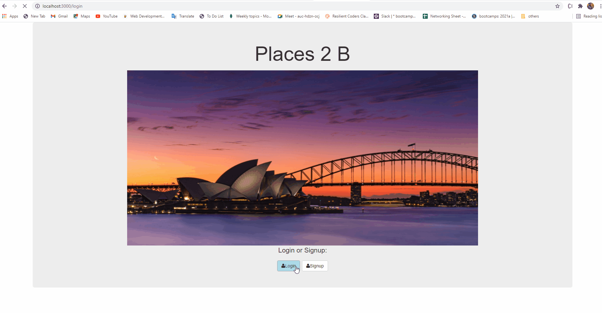

# Places 2 b
Have a Travel destination and you want to know a few places in that area that you visit, chill at or dine-in? Look no furthur, Places-2-b allows you to search for a place and returns all the nearby spots that you can visit.

## Link to profect 
https://places-2-b.herokuapp.com/

## How it is made 
Tech used; EJS, Node.JS, MongoDB, Passport.JS

 Full stack web app that leverages the foursquare api to render places of interest in a given city. A user is able to search for a location and the app displays some of the places that they might find interesting. A user is able to save these locations and delete them if desired. This app uses CRUD functionality and leverages passport.JS for authentication.
 
### Optimization
In order to improve the accuracy of the filter while deleting the list items from the database, I used the ObjectID that's generated by mongodb 

### Other full Stack Apps
https://danstans-sticky-notes.herokuapp.com/
